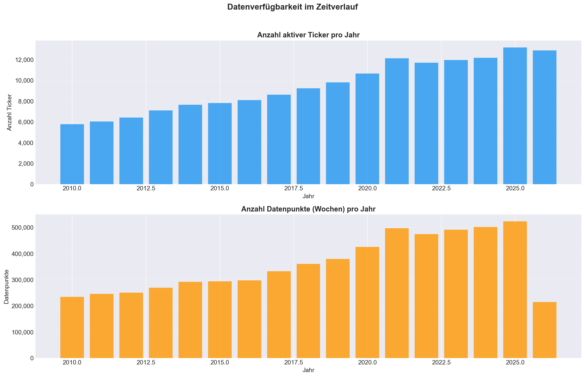
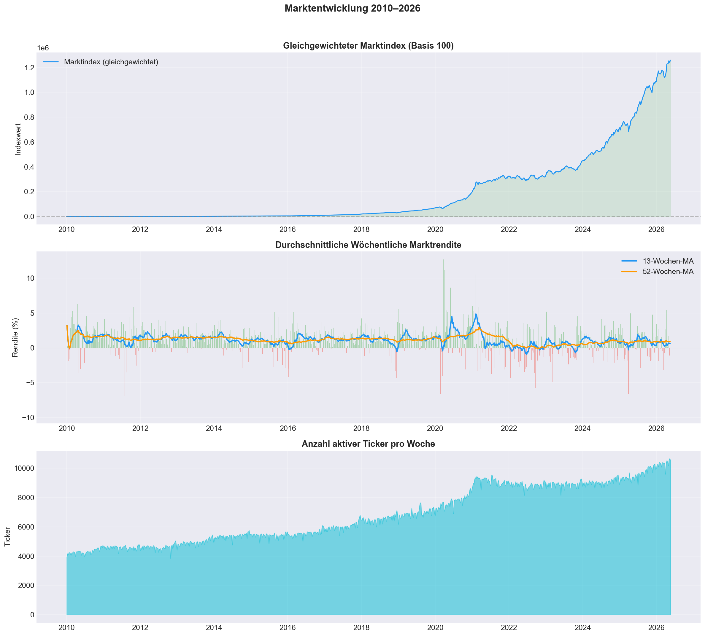
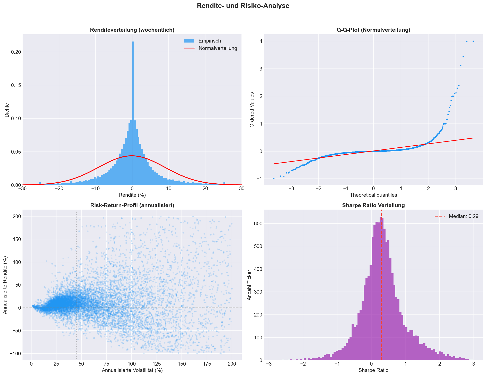
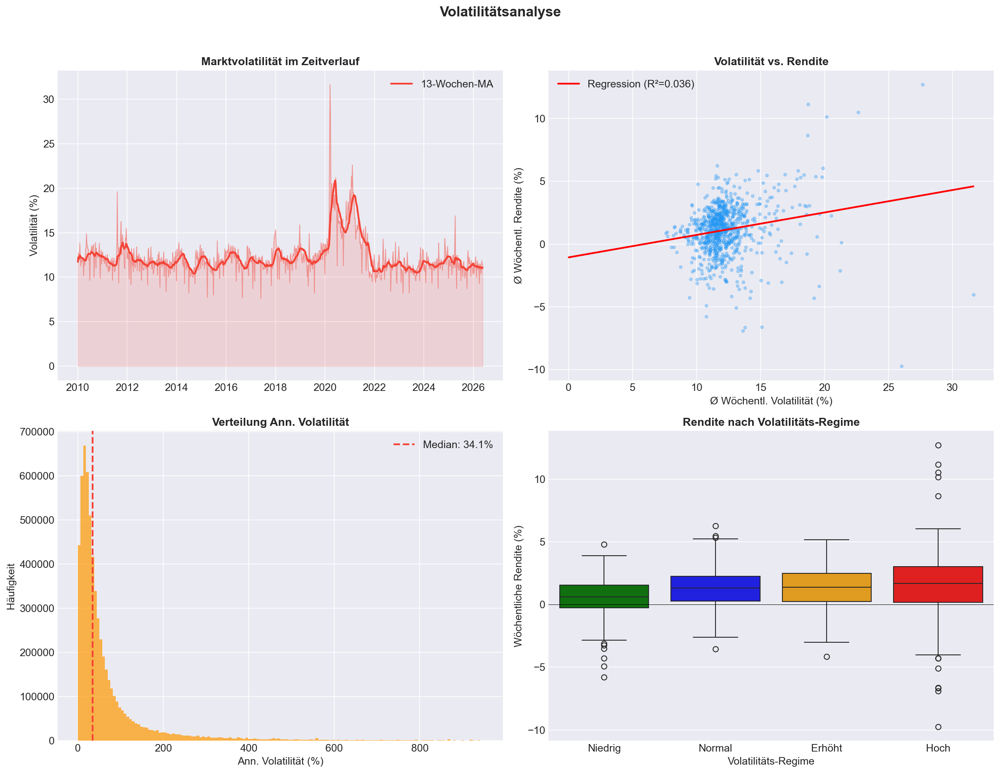
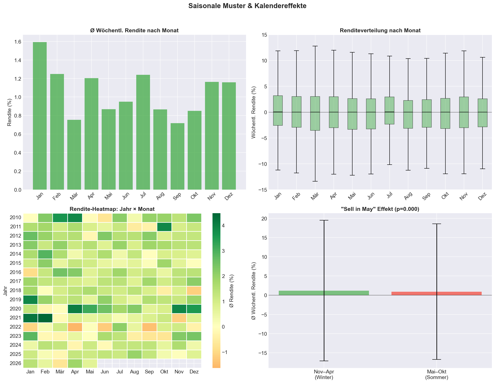
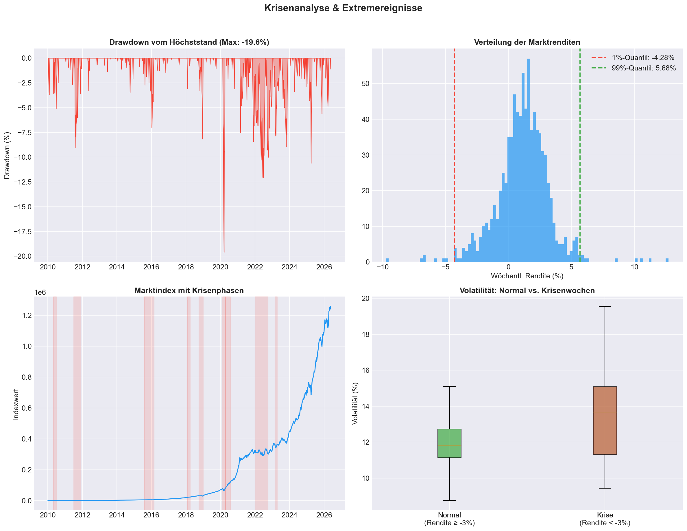
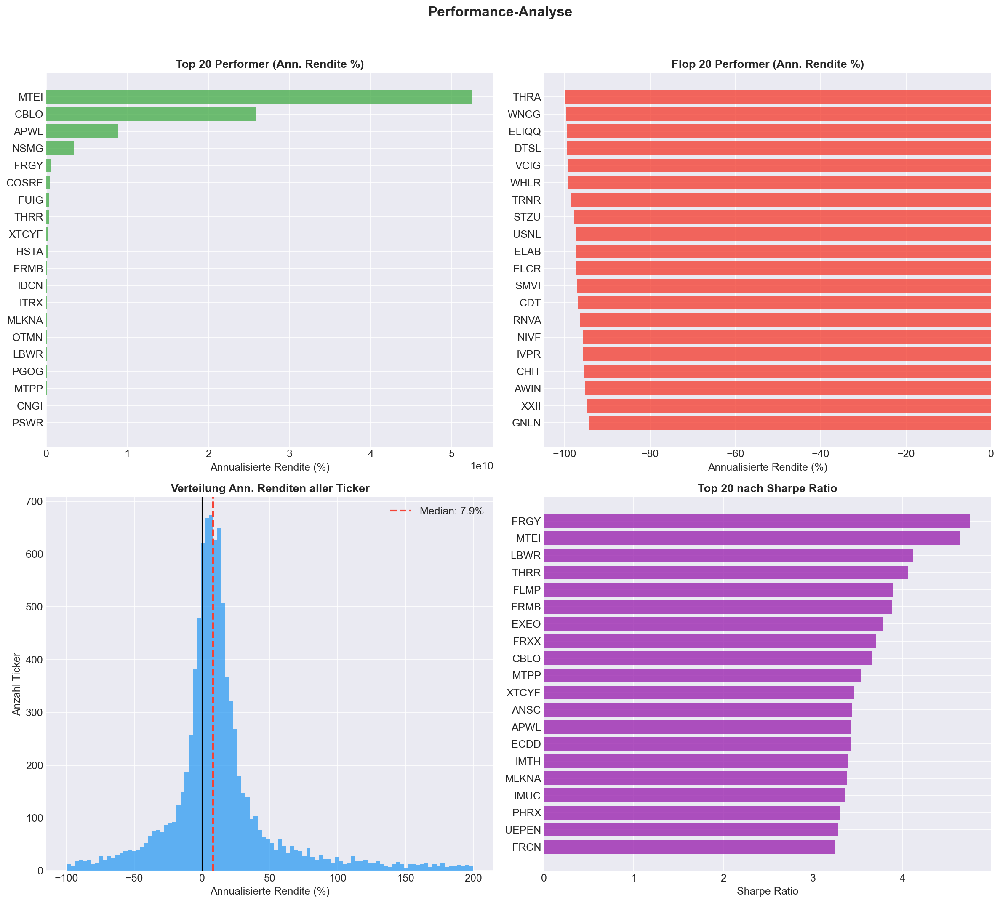
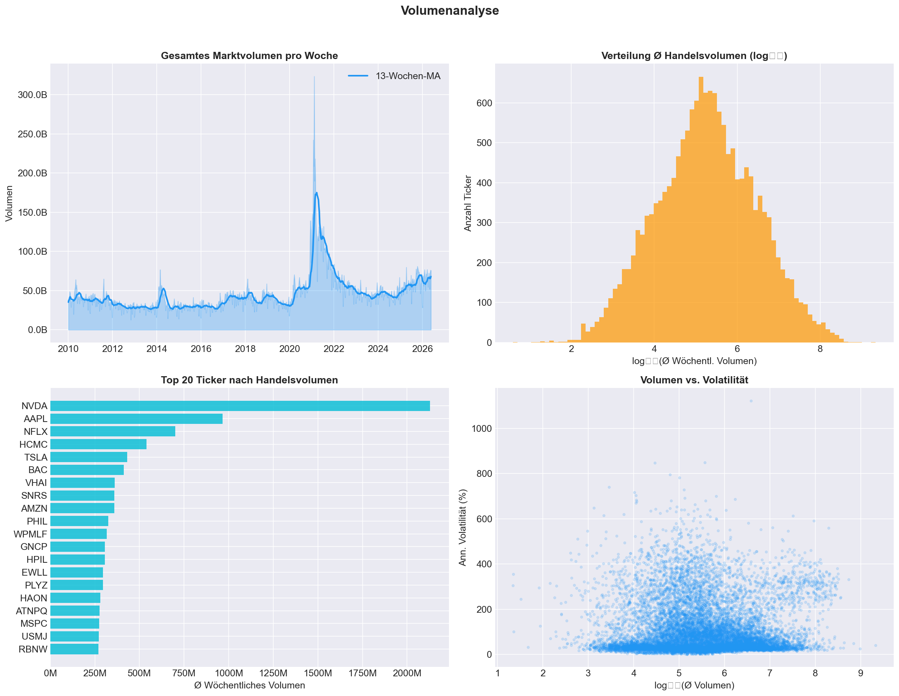
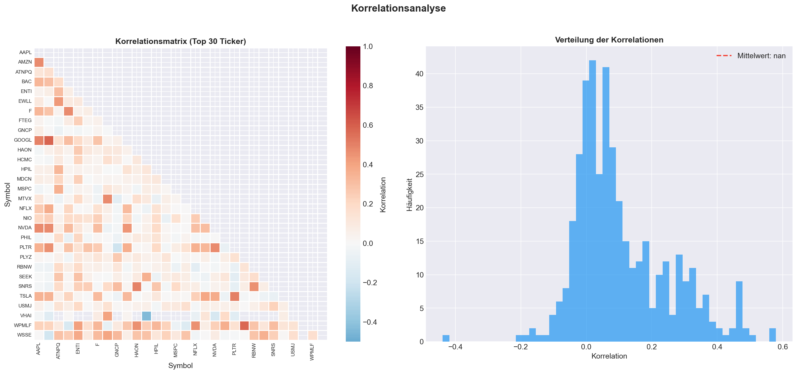
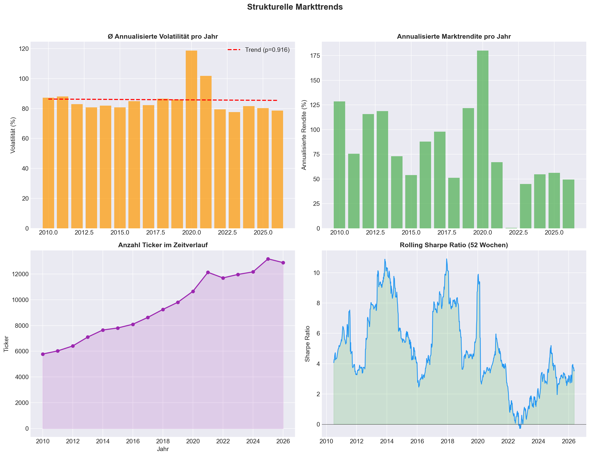

# 📈 Empirical Stock Market Analysis (2010–2026)

This repository contains a comprehensive, big-data empirical analysis of the global stock market from January 2010 to May 2026, analyzing **6.08 million weekly observations** across **16,322 unique tickers**. 

It provides an end-to-end data pipeline: from raw Kaggle daily stock data (3.54 GB) to a clean, aggregated weekly dataset optimized for Power BI, followed by an advanced econometric and statistical analysis.

---

## 📂 Repository Structure

* 🐍 **`preprocess_stocks.py`**: A high-performance preprocessor script that leverages **DuckDB** and **Pandas** to ingest, clean, filter, and aggregate daily stock prices into weekly records. It reduces the raw 3.54 GB dataset to a highly optimized ~727 MB CSV file (`stocks_weekly_powerbi.csv`), ready for Power BI.
* 📊 **`stock_analysis.py`**: A comprehensive statistical analysis script that performs descriptive analysis, tests seasonal calendar effects, calculates autocorrelation/volatility clustering, runs crisis drawdowns, and extracts the top/flop performers. It automatically generates the 10 PNG charts and the text report.
* 📄 **`Aktienmarkt_Analyse_Bericht.txt`**: The raw, auto-generated statistical report containing descriptive statistics, seasonal t-tests, volatility regimes, and correlation matrices.
* 📘 **`Aktienmarkt_Ausfuehrliche_Interpretation.md`**: A detailed, academic-grade scientific interpretation report in German, explaining each finding and connecting it to major financial theories (EMH, MPT, GARCH, Small-Firm Effect).
* 🖼️ **`01_datenverfuegbarkeit.png` to `10_strukturelle_trends.png`**: The 10 high-resolution analytical plots visualizing the market's behavior.

---

## 📊 Core Empirical Findings

### 1. Market Development & The Small-Firm Anomaly
An equal-weighted index of all 16,322 stocks grew from a base of 100 in 2010 to over **1.25 million** in 2026, representing an annualized return of **79.47%**. This massive outperformance compared to market-cap-weighted indices is a classic demonstration of the **Small-Firm Anomaly (Fama & French, 1992)**, where high-beta micro-caps and penny stocks experience massive positive skewness and asymmetric gains.

### 2. Violations of the Efficient Market Hypothesis (EMH)
We found highly statistically significant calendar anomalies that contradict the weak form of Fama's EMH:
* **The January Effect**: Weekly returns in January average **1.59%** compared to **1.00%** during the rest of the year ($t = 22.75$, $p \approx 0$).
* **The "Sell in May" Effect**: Weekly returns from November to April average **1.18%** compared to **0.92%** from May to October ($t = 18.34$, $p \approx 0$).

### 3. Non-Normality & "Fat Tails"
The distribution of weekly returns exhibits a Skewness of **7.55** and an extreme Kurtosis of **121.24** (excess). Normality tests (Jarque-Bera, Kolmogorov-Smirnov) reject the normal distribution hypothesis on a 99.9% level ($p \approx 0$). This empirical evidence confirms the presence of **"Fat Tails"** (Black Swans), demonstrating that standard risk models (e.g., Value-at-Risk based on standard deviation) severely underestimate systemic ruin risk.

### 4. Volatility Clustering (ARCH Effect)
The weekly volatility shows a strong and slowly decaying autocorrelation (Lag 1 = **0.73**, Lag 12 = **0.47**), confirming the **ARCH/GARCH effect**. Periods of high volatility are highly clustered, validating dynamic volatility models over static assumptions.

### 5. Liquidity & Volume Dynamics
**Nvidia (NVDA)** leads the market's liquidity with an average weekly volume of **2.13 billion shares**, followed by Apple (AAPL) with **966 million shares**. We found **no significant correlation** between weekly trading volume and price returns ($r = 0.02$, $p = 0.56$), showing that trading volume is a proxy for information flow and volatility, but does not predict weekly price direction.

---

## 🖼️ Visualizations

The analysis generates 10 high-resolution charts representing different econometric facets:

```carousel

<!-- slide -->

<!-- slide -->

<!-- slide -->

<!-- slide -->

<!-- slide -->

<!-- slide -->

<!-- slide -->

<!-- slide -->

<!-- slide -->

```

---

## 🛠️ How to Setup & Run

### Prerequisites
Make sure you have Python 3.8+ installed. Install the required libraries:
```bash
pip install duckdb pandas numpy scipy matplotlib seaborn
```

### Step 1: Preprocess the Data
1. Download the Kaggle dataset: [All Stock Market Data (Daily Updates)](https://www.kaggle.com/datasets/ayushkhaire/all-stock-market-data-daily-updates).
2. Extract the ZIP file so that the `archive/` folder containing individual CSVs is located in your `~/Downloads` directory.
3. Run the preprocessor script:
   ```bash
   python preprocess_stocks.py
   ```
4. This will create `/Users/paul/Downloads/stocks_weekly_powerbi.csv` (approx. 727 MB), which is pre-filtered and perfect for importing into **Power BI** or **Tableau**.

### Step 2: Run the Econometric Analysis
Run the main analysis script to generate the statistics and visualizations:
```bash
python stock_analysis.py
```
This script automatically:
1. Loads the preprocessed weekly CSV.
2. Conducts econometric testing.
3. Outputs the text report `Aktienmarkt_Analyse_Bericht.txt`.
4. Saves all 10 high-resolution charts in the `Aktienmarkt_Analyse/` folder.

---

*This project was created as a scientific framework and data pipeline for an academic research paper on big data stock market econometrics.*
