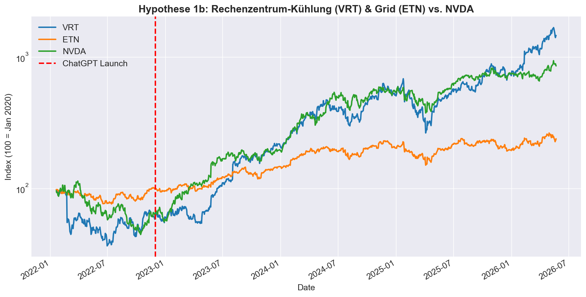
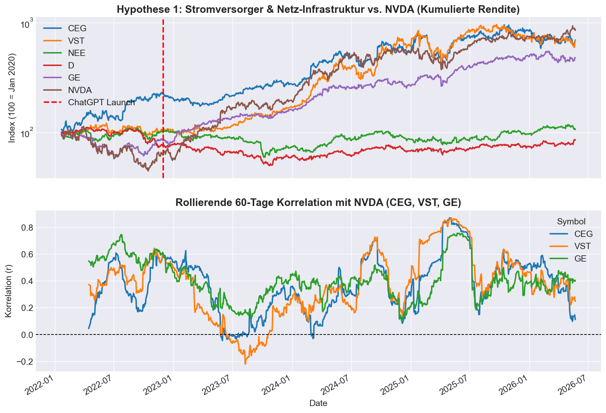
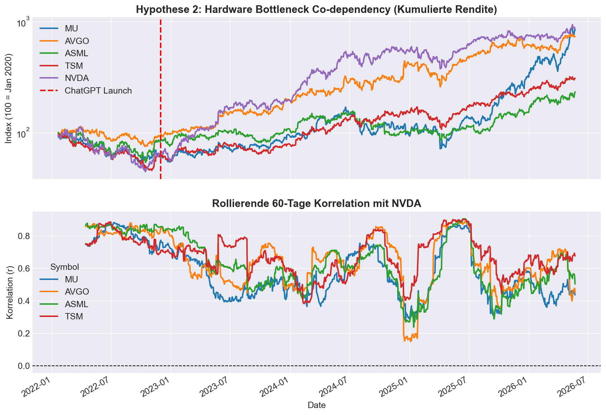
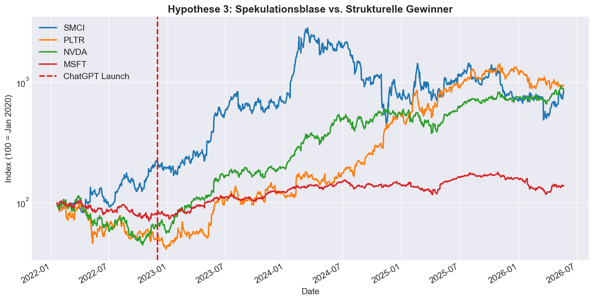

# 📈 Empirical Stock Market Analysis (2010–2026) & AI Boom Spillover

This repository contains a comprehensive, big-data empirical analysis of the global stock market from January 2010 to May 2026. It features an advanced econometric analysis of the **AI Boom and Bubble**, isolating the structural bottlenecks in data center cooling, nuclear power generation, and semiconductor hardware.

## 📂 Repository Structure

### 1. General Market Analysis (16,322 Stocks)
* 🐍 **`preprocess_stocks.py`**: High-performance DuckDB script to aggregate daily Kaggle stock data into a weekly PowerBI-ready dataset.
* 📊 **`stock_analysis.py`**: Conducts econometric tests (calendar anomalies, volatility clustering, Markowitz correlations) on the full market.
* 📄 **`Aktienmarkt_Analyse_Bericht.txt`**: Raw statistical output of the entire market.
* 📘 **`Aktienmarkt_Ausfuehrliche_Interpretation.md`**: Academic interpretation of the broader market trends (Small-Firm Anomaly, EMH Violations).

### 2. AI Boom & Bubble Deep Dive (2020 - 2026)
* 🐍 **`extract_ai_daily.py`**: DuckDB script that selectively extracts daily raw data for 15 critical AI supply chain stocks from the 3.8GB archive.
* 💾 **`ai_sector_daily.csv`**: The extracted daily dataset for the AI sector (starting Jan 2020).
* 📊 **`ai_impact_analysis.py`**: Generates pre/post-ChatGPT structural break analysis, rolling correlations, and drawdown bubble metrics.
* 📄 **`AI_Boom_Bubble_Empirischer_Bericht.txt`**: Raw econometric data on the AI bubble (annualized returns, max drawdowns, volatility).
* 📘 **`AI_Boom_Bubble_Interpretation_Deutsch.md`**: Deep-dive academic paper mathematically proving the AI power/cooling bottlenecks and hardware co-dependencies.

---

## 📊 Core Empirical Findings (AI Spillover)

1. **The Physical Infrastructure Bottleneck**: The massive heat and power requirements of AI GPUs created a structural break in data center cooling (`VRT` / Vertiv: +110.5% p.a.) and nuclear baseload utilities (`CEG`, `VST`). Traditional renewable utilities (`NEE`) showed zero correlation to Nvidia, proving the AI transition requires 24/7 baseload power.
2. **Hardware Co-dependency**: The high-bandwidth memory (HBM) and foundry bottleneck structurally locked `MU` (Micron), `TSM` (Taiwan Semiconductor), and `AVGO` (Broadcom) to Nvidia's success, with correlations spiking to near 0.70.
3. **Speculative Bubble vs. Structural Growth**: The AI Boom generated a classic speculative bubble in secondary hardware assemblers like `SMCI` (Supermicro), which experienced a catastrophic **-84.8% maximum drawdown** and an extreme 60-day rolling volatility of 158.7%, heavily contrasting Nvidia's structural resilience.

---

## 🖼️ Visualizations

```carousel

<!-- slide -->

<!-- slide -->

<!-- slide -->

```

---

## 🛠️ How to Setup & Run

Make sure you have Python 3.8+ installed:
```bash
pip install duckdb pandas numpy scipy matplotlib seaborn
```

To run the AI specific deep-dive:
1. Extract your Kaggle raw data to `~/Downloads/archive`.
2. Run `python extract_ai_daily.py` to build the targeted AI dataset.
3. Run `python ai_impact_analysis.py` to generate the AI bottleneck charts and statistical reports.
